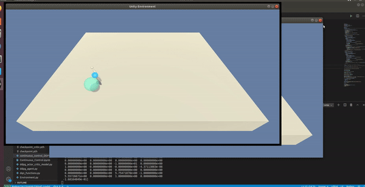
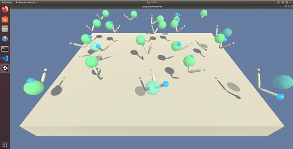

# Continuous Control with Reacher and DDPG

This repository contains my codes, report and other files for Udacity Deep Reinforcement Learning Nanodegree Project 2: Continuous Control.

## Project's goal

In this environment, a double-jointed arm can move to target locations. A reward of +0.1 is provided for each step that the agent's hand is in the goal location. Thus, the goal of the agent is to maintain its position at the target location for as many time steps as possible.

### Environment details

The environment is based on [Unity ML-agents](https://github.com/Unity-Technologies/ml-agents). Unity ML-Agents is an open-source Unity plugin that enables games and simulations to serve as environments for training intelligent agents.

**Note:** The Unity ML-Agent team frequently releases updated versions of their environment. We are using the v0.4 interface. The project environment provided by Udacity is similar to, but not identical to the [Reacher](https://github.com/Unity-Technologies/ml-agents/blob/master/docs/Learning-Environment-Examples.md#reacher) environment on the Unity ML-Agents GitHub page.

The observation space consists of 33 variables corresponding to position, rotation, velocity, and angular velocities of the arm. Each action is a vector with four numbers, corresponding to torque applicable to two joints. Every entry in the action vector should be a number between -1 and 1.

- Set-up: Double-jointed arm which can move to target locations.
- Goal: The agents must move it's hand to the goal location, and keep it there.
- Agents: The environment contains 10 agent with same Behavior Parameters. (The provided Udacity agent versions are Single Agent or 20 Agents.)
- Agent Reward Function (independent):
  - +0.1 Each step agent's hand is in goal location.
- Behavior Parameters:
  - Vector Observation space: 26 variables corresponding to position, rotation, velocity, and angular velocities of the two arm Rigidbodies.
  - Vector Action space: (Continuous) Size of 4, corresponding to torque applicable to two joints.
  - Visual Observations: None.
- Benchmark Mean Reward: 30

For this project, Udacity provides two separate versions of the Unity environment:
- The first version contains a single agent.
- The second version contains 20 identical agents, each with its own copy of the environment.

The second version is useful for algorithms like [PPO](https://arxiv.org/pdf/1707.06347.pdf), [A3C](https://arxiv.org/pdf/1602.01783.pdf), and [D4PG](https://openreview.net/pdf?id=SyZipzbCb) that use multiple (non-interacting, parallel) copies of the same agent to distribute the task of gathering experience.

### Solving the environment

#### Single Agent DDPG

The task is episodic, and in order to solve the environment, the agent must get an average score of +30 over 100 consecutive episodes. In my implementation I chose to use a DDPG actor-critic agent to solve it.

#### Multi Agent DDPG

In order to solve the environment, the 20 agents must get an average score of +30 over 100 consecutive episodes. In my implementation I chose to use a multi agent DDPG actor-critic agent to solve it.

## Getting started

### Installation requirements

- To begin with, you need to configure a Python 3.6 / PyTorch 0.4.0 environment with the requirements described in [Udacity repository](https://github.com/udacity/deep-reinforcement-learning#dependencies)
- Then you need to clone this project and have it accessible in your Python environment
- For this project, you will not need to install Unity. This is because we have already built the environment for you, and you can download it from one of the links below. You need to only select the environment that matches your operating system:

    - **_Version 1: One (1) Agent_**
        - Linux: [click here](https://s3-us-west-1.amazonaws.com/udacity-drlnd/P2/Reacher/one_agent/Reacher_Linux.zip)
        - Mac OSX: [click here](https://s3-us-west-1.amazonaws.com/udacity-drlnd/P2/Reacher/one_agent/Reacher.app.zip)
        - Windows (32-bit): [click here](https://s3-us-west-1.amazonaws.com/udacity-drlnd/P2/Reacher/one_agent/Reacher_Windows_x86.zip)
        - Windows (64-bit): [click here](https://s3-us-west-1.amazonaws.com/udacity-drlnd/P2/Reacher/one_agent/Reacher_Windows_x86_64.zip)

    - **_Version 2: Twenty (20) Agents_**
        - Linux: [click here](https://s3-us-west-1.amazonaws.com/udacity-drlnd/P2/Reacher/Reacher_Linux.zip)
        - Mac OSX: [click here](https://s3-us-west-1.amazonaws.com/udacity-drlnd/P2/Reacher/Reacher.app.zip)
        - Windows (32-bit): [click here](https://s3-us-west-1.amazonaws.com/udacity-drlnd/P2/Reacher/Reacher_Windows_x86.zip)
        - Windows (64-bit): [click here](https://s3-us-west-1.amazonaws.com/udacity-drlnd/P2/Reacher/Reacher_Windows_x86_64.zip)
    
    (_For Windows users_) Check out [this link](https://support.microsoft.com/en-us/help/827218/how-to-determine-whether-a-computer-is-running-a-32-bit-version-or-64) if you need help with determining if your computer is running a 32-bit version or 64-bit version of the Windows operating system.

    (_For AWS_) If you'd like to train the agent on AWS (and have not [enabled a virtual screen](https://github.com/Unity-Technologies/ml-agents/blob/master/docs/Training-on-Amazon-Web-Service.md)), then please use [this link](https://s3-us-west-1.amazonaws.com/udacity-drlnd/P2/Reacher/one_agent/Reacher_Linux_NoVis.zip) (version 1) or [this link](https://s3-us-west-1.amazonaws.com/udacity-drlnd/P2/Reacher/Reacher_Linux_NoVis.zip) (version 2) to obtain the "headless" version of the environment.  You will **not** be able to watch the agent without enabling a virtual screen, but you will be able to train the agent.  (_To watch the agent, you should follow the instructions to [enable a virtual screen](https://github.com/Unity-Technologies/ml-agents/blob/master/docs/Training-on-Amazon-Web-Service.md), and then download the environment for the **Linux** operating system above._)

- Finally, you can unzip the environment archive in the project's environment directory and set the path to the UnityEnvironment in the code.

## Instructions

### Training an agent
    
You can either run `Continuous_Control.ipynb` in the Udacity Online Workspace for "Project2: Continuous Control" step by step or build your own local environment and set the path to the UnityEnvironment in the code. You can also run the script `continuous_control_DDPG.py` if you prefer a built-in program instead of a step by step notebook.

**Note:** The Workspace does not allow you to see the simulator of the environment; so, if you want to watch the agent while it is training, you should train locally.    
